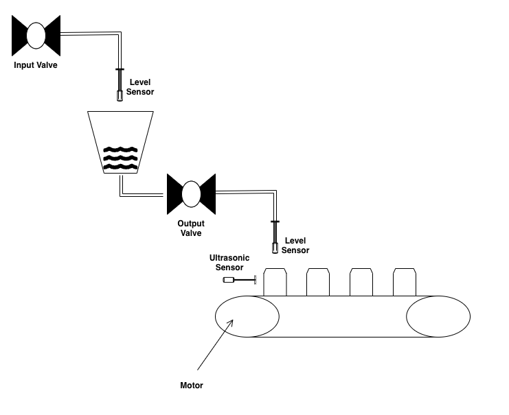

# Automatic Bottle Filler

This example simulates a bottle-filling process, it consists of a water tank being controlled by a PLC and a bottle-filling process being controlled by a second PLC that uses the water in the tank to fill the bottles on a conveyor belt, as shown in the following image.



The process parameters are the following:

| Name                | Value     |
|---------------------|-----------|
| Base area of the water tank | `300 cm2` |
| Input valve flow (ON/OFF) | `0.5 L/s` |
| Output valve flow (ON/OFF) | `0.03 L/s` |
| Height of the water bottle | `20 cm` |
| Bottle base area | `100 cm2` |
| Conveyor belt speed | `0.05 m/s` |
| Distance between two consecutive bottles | `0.2 m` |


---
**NOTE**

We use the `python` library in this example, although a `c++` version of the code can be found [here(TODO:ADD C++ VERSION)]().

---

## Project Setup 

Start by creating a new directory.
```sh
mkdir bottle_filler
cd bottle_filler
```
Clone and build tinyics.
```sh
# clone the repository
git clone --recursive https://github.com/ale-candia/tinyics.git

# configure the build
cd tinyics
bash config.sh

# build the project (use -j n to use more cores during the build) 
cd build/
make

# go back to the project's root
cd ../../
```
Once the library has been built successfully, it can be imported from the project's root.

## Water Tank Process

We'll start by defining the PLC controlling the water tank as well as the physics for the water tank.

Let's start by specifying the parameters of the process.

```python
# file -> water_tank.py
import tinyics

class WaterTank(tinyics.IndustrialProcess):
    TANK_BASE_AREA = 300        # base area of the water tank [cm2]
    INPUT_VALVE_FLOW = 0.5      # rate at which water enters the tank [L/s]
    OUTPUT_VALVE_FLOW = 0.03    # rate at which water exits the tank [L/s]

    def __init__(self):
        super().__init__()

        self.prev_time = 0

        self.curr_height = tinyics.AnalogSensor(0, 10)
```
We use the `AnalogSensor` to measure the height since this is a continuous variable. The parameters 0 and 10 for the constructor are, respectively, the minimum and maximum values the sensor can measure, in our particular case we assume the sensor can measure the height from 0 to 10 cm.

Now we specify where the sensors and actuators go, we can do this by defining constants in the PLC.

```python
# file -> water_tank.py
class PlcWaterTank(tinyics.Plc):
    # position of the sensors (inputs)
    LEVEL_SENSOR_POS = 0   # position 0 among analog inputs

    # position of the actuators (outputs)
    INPUT_VALVE_POS = 0    # position 0 among digital outputs (coils)

    # constants
    MAX_HEIGHT = 7.5    # maximum height at which the tank will be filled [cm]
    MIN_HEIGHT = 4      # minimum height at which the tank will be filled [cm]

    def __init__(self, name):
        # initialize the class with a unique name
        super().__init__(name)
        self.link_process(WaterTank(), 1) # link a water tank process to the PLC
```

Here we specified that the level sensor (continuous variable) will be connected to the first of the analog inputs of the PLC (position 0). Similarly, the valve actuator will be connected to the first of the digital outputs. `MAX_HEIGHT` and `MIN_HEIGHT` are program constants that specify the range in which we want to maintain the water level in the tank. We've also linked the plc to a new instance of the `WaterTank` industrial process so we don't have to do that in our main program.

To ensure proper execution, we used the `self.link_process()` method with a priority of 1 for the water tank process. This grants it higher priority over the bottle-filling process, establishing a dependency. The water tank process must execute first, as we need to check water availability before filling bottles.

With that in place, we can go ahead and override the `Update()` method in the `PlcWaterTank` to specify the control logic for the PLC.

```python
# file -> water_tank.py
def Update(self, measured, plc_out):

    # current height of the tank
    height = tinyics.scale_word_to_range(
        measured.get_analog_state(self.LEVEL_SENSOR_POS), 0, 10)

    # if we reached the max height, stop filling the tank
    if height >= self.MAX_HEIGHT:
        plc_out.set_digital_state(self.INPUT_VALVE_POS, False)

    # water level to low, start filling the tank
    elif height <= self.MIN_HEIGHT:
        plc_out.set_digital_state(self.INPUT_VALVE_POS, True)
```

Note that we're using the `tinyics.scale_word_to_range()` function in the range 0, 10. This is because PLC inputs are actually stored as a 2-byte representation of the actual float value in the range specified by the sensor constructor. So we need to scale it back to this range in order to get the actual height of the water level.

From here we override the `UpdateProcess()` method inside the `WaterTank` class to specify the logic for updating the state of the process and the sensor measurements.

```python
# file -> water_tank.py

def UpdateProcess(self, measurements, input):
    current = tinyics.get_current_time()
    elapsed_time = current - self.prev_time

    input_valve_on = input.get_digital_state(PlcWaterTank.INPUT_VALVE_POS)
    output_valve_on # we don't have this information

    # transform from cm3 to L
    amount = self.curr_height.get_value() * self.TANK_BASE_AREA / 1000

    # update the state of the process
    if input_valve_on:
        amount += self.INPUT_VALVE_FLOW * elapsed_time

    if output_valve_on:
        amount -= self.OUTPUT_VALVE_FLOW * elapsed_time
    
    if amount <= 0:
        amount = 0

    self.prev_time = current
    self.curr_height.set_value(amount * 1000 / self.TANK_BASE_AREA)

    # update the measurements of the PLC
    measurements.set_analog_state(PlcWaterTank.LEVEL_SENSOR_POS, self.curr_height)
```

A couple of things to notice here. First, notice that we're using the `get_value()` and `set_value()` on `self.curr_height` to get and set the current height. It's important to use these functions because if we were to do something like `self.curr_height = 0` we would be turning `self.curr_height` into an integer, which will make the function `measurements.set_analog_state()` fail since it expects an analog sensor.

Second, notice that there is no way for us to know whether the output valve is open or not since this valve is controlled by the PLC controlling the bottle-filling process. In order to get access to this information we will need to define a global variable so that we can share this information.

We can create a new file for these global variables.

```python
# file -> globals.py
class GlobalParams:
    # whether the draining valve is on (set by the PLC controlling
    # the bottle filler)
    OUTPUT_VALVE_ON = False
```

Now we can complete the `UpdateProcess()` method.

```python
# file -> water_tank.py
from globals import GlobalParams # import GlobalParams

# water tank class
def UpdateProcess(self, measurements, input):
    current = tinyics.get_current_time()
    elapsed_time = current - self.prev_time

    input_valve_on = input.get_digital_state(PlcWaterTank.INPUT_VALVE_POS)
    output_valve_on = GlobalParams.OUTPUT_VALVE_ON

    # transform from cm3 to L
    amount = self.curr_height.get_value() * self.TANK_BASE_AREA / 1000

    # update the state of the process
    if input_valve_on:
        amount += self.INPUT_VALVE_FLOW * elapsed_time

    if output_valve_on:
        amount -= self.OUTPUT_VALVE_FLOW * elapsed_time
    
    if amount <= 0:
        amount = 0

    self.prev_time = current
    self.curr_height.set_value(amount * 1000 / self.TANK_BASE_AREA)

    # update the measurements of the PLC
    measurements.set_analog_state(PlcWaterTank.LEVEL_SENSOR_POS, self.curr_height)
```

## Bottle Filling Process

Now let's start the same way for the bottle-filling process, defining the connections and constants both in the process and the PLC.

For the industrial process.

```python
# file -> bottle_filler.py
import tinyics
from globals import GlobalParams

class BottleFiller(tinyics.IndustrialProcess):
    BOTTLE_HEIGHT = 20      # height of the bottle is [cm]
    BOTTLE_BASE_AREA = 100  # base area of the water bottle [cm2]
    CONVEYOR_SPEED = 0.05   # how fast the conveyor belt moves when activated [m/s]
    BOTTLE_DISTANCE = 0.2   # the distance between two consecutive bottles [m]

    def __init__(self):
        super().__init__()

        self.prev_time = 0
        self.bottle_distance_to_tap = 0

        # an analog sensor that measures the height of the water in the bottle
        self.bottle_water_level = tinyics.AnalogSensor(0, 20)
```

Here, `bottle_water_level` is an `AnalogSensor` but `bottle_distance_to_tap` isn't. This is because we are not 'measuring' the `bottle_distance_to_tap`, this is only a local variable we use to compute the physics of the process, similar to the prev_time (previous time step). `bottle_distance_to_tap` is used to compute how much distance has the previous bottle traveled. We assume that bottles are equally spaced from each other.

For the PLC.

```python
# file -> bottle_filler.py
class PlcBottle(tinyics.Plc):
    # position of the sensors (inputs)
    BOTTLE_LEVEL_POS = 0        # position 0 among analog inputs
    BOTTLE_DETECTED_POS = 0     # position 0 among digital inputs

    # position of the actuators (outputs)
    CONVEYOR_POS = 0            # position 0 among the digital outputs (coils)
    VALVE_POS = 1               # position 1 among the digital outputs (coils)

    # constants
    MAX_BOTTLE_LEVEL = 0.75

    def __init__(self, name):
        # initialize the class with a unique name
        super().__init__(name)
        self.link_process(BottleFiller()) # link the process to the bottle fill process
```

We can now go ahead and override the `Update()` method for the `PlcBottle` class.

```python
# file -> bottle_filler.py
def Update(self, measured, plc_out):
    bottle_level = tinyics.scale_word_to_range(
        measured.get_analog_state(self.BOTTLE_LEVEL_POS), 0, 20)

    if measured.get_digital_state(self.BOTTLE_DETECTED_POS):
        # if the bottle is in place and still not completely filled, then open
        # the valve to pour water and stop the conveyor belt
        if bottle_level >= 0 and bottle_level < self.MAX_BOTTLE_LEVEL:
            plc_out.set_digital_state(self.VALVE_POS, True)
            plc_out.set_digital_state(self.CONVEYOR_POS, False)

            GlobalParams.OUTPUT_VALVE_ON = True

        # if the bottle is in position but completely filled then close the valve
        # and move the conveyor
        else:
            plc_out.set_digital_state(self.VALVE_POS, False)
            plc_out.set_digital_state(self.CONVEYOR_POS, True)

            GlobalParams.OUTPUT_VALVE_ON = False
```

Note that we're also updating the `GlobalParams.OUTPUT_VALVE_ON` as we change its state for other parts of the code to know as well.

Now let's override the `UpdateProcess()` method for the `BottleFiller` class.

```python
# file -> bottle_filler.py
def UpdateProcess(self, measurements, input):
    current = tinyics.get_current_time()
    elapsed_time = current - self.prev_time

    #### update position of the water bottle in the conveyor ####

    conveyor_moving = input.get_digital_state(PlcBottle.CONVEYOR_POS)

    if conveyor_moving:
        self.bottle_distance_to_tap += elapsed_time * self.CONVEYOR_SPEED

    #### update level of water on the bottle ####

    bottle_in_place = (self.bottle_distance_to_tap >= self.BOTTLE_DISTANCE
                        or self.bottle_distance_to_tap == 0)
    valve_on = input.get_digital_state(PlcBottle.VALVE_POS)

    # transform from cm3 to L
    amount = self.bottle_water_level.get_value() * self.BOTTLE_BASE_AREA / 1000
    if bottle_in_place:
        if valve_on:
            amount += # TANK_OUTPUT_FLOW * elapsed_time
            if amount > self.BOTTLE_HEIGHT * self.BOTTLE_BASE_AREA / 1000:
                print('[WARNING] bottle of water overflowing')

        self.bottle_distance_to_tap = 0
    else:
        amount = 0
        if valve_on:
            print('[WARNING] dropping water without a bottle')

    self.prev_time = current
    self.bottle_water_level.set_value(amount * 1000 / self.BOTTLE_BASE_AREA)

    #### update measurements ####
    measurements.set_digital_state(PlcBottle.BOTTLE_DETECTED_POS, bottle_in_place)
    measurements.set_analog_state(PlcBottle.BOTTLE_LEVEL_POS, self.bottle_water_level)
```

Again, we don't have access to the `TANK_OUTPUT_FLOW` from our method, we could import the `WaterTank` class into this file and do `WaterTank.OUTPUT_VALVE_FLOW`. However, the issue with doing this is that the tank could be empty at some point. In that scenario, the output flow would be zero. So we can define a new global variable and use that instead.

```python
# file -> globals.py
class GlobalParams:
    # rate at which water leaves the tank
    TANK_OUTPUT_FLOW = 0

    # whether the draining valve is on (set by the PLC controlling
    # the bottle filler)
    OUTPUT_VALVE_ON = False
```

We can update this value from the `WaterTank` class according to whether there is or isn't water in the tank at one particular moment.

```python
#file -> water_tank.py
class WaterTank(tinyics.IndustrialProcess):
    # code

    def UpdateProcess(self, measurements, input) -> tinyics.PlcState:
        # code
        
        if amount <= 0:
            amount = 0
            GlobalParams.TANK_OUTPUT_FLOW = 0
        else:
            GlobalParams.TANK_OUTPUT_FLOW = self.OUTPUT_VALVE_FLOW

        # code
```

With this, the commented section in `UpdateProcess()` of the `BottleFiller` can be updated to.

```python
# file -> bottle_filler.py
amount += GlobalParams.TANK_OUTPUT_FLOW * elapsed_time
```

## Simulation

Now we can build the simulation by importing our PLCs into a main file and running the simulation.

```python
import tinyics
from bottle_filler import PlcBottle 
from water_tank import PlcWaterTank 

def generate_plot(scada):
    import matplotlib.pyplot as plt

    plt.plot(scada.get_t(), scada.get_height())
    plt.label('Water Tank Height')
    plt.grid()
    plt.show()

class MyScada(tinyics.Scada):
    def __init__(self, name):
        super().__init__(name)

        self.tank_height = []
        self.t = []

    def Update(self, vars):
        # measure the tank height and store it in an array
        self.tank_height.append(tinyics.scale_word_to_range(vars["tank_height"].get_value(), 0, 10))
        self.t.append(tinyics.get_current_time())

    def get_height(self):
        return self.tank_height
    
    def get_t(self):
        return self.t

# Define the control system components
plc_wt = PlcWaterTank("wt")
plc_bf = PlcBottle("bf")
scada = MyScada("scada")

# Construct the industrial network
networkBuilder = tinyics.IndustrialNetworkBuilder(
        tinyics.Ipv4Address("192.168.1.0"),
        tinyics.Ipv4Mask("255.255.255.0"))

networkBuilder.add_to_network(scada)
networkBuilder.add_to_network(plc_wt)
networkBuilder.add_to_network(plc_bf)
networkBuilder.build_network()

# Specify system connections
scada.add_rtu(plc_wt.get_address())
scada.add_rtu(plc_bf.get_address())

scada.add_variable(plc_wt, "tank_height", tinyics.VarType.InputRegister, plc_wt.LEVEL_SENSOR_POS)
scada.add_variable(plc_bf, "bottle_level", tinyics.VarType.InputRegister, plc_bf.BOTTLE_LEVEL_POS)

# networkBuilder.enable_pcap("sim")

# Run the simulation
tinyics.run_simulation()
generate_plot(scada)
```

- We added a `generate_plot` using [matplotlib](https://matplotlib.org/) to display a picture at the end of the simulation showing the height of the tank.
- `networkBuilder.enable_pcap("sim")` can also be uncommented to capture network traffic into a .pcap file.

---
**NOTE**

With graphs, the sampling time should be considered. The SCADA usually has a higher sampling time than the PLC and if the process changes too rapidly relative to this sampling time, it might be better to take measurements during the physics (`IndustrialProcess` class) simulation if the objective is to get a more precise graph of the process.

---
