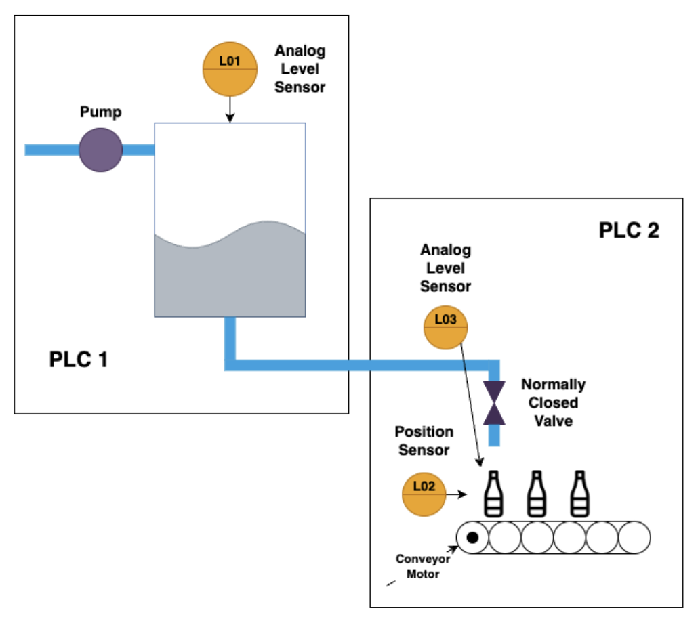

# Automatic Bottle Filler

This example simulates a bottle-filling process. It consists of a water tank controlled by a PLC and a bottle-filling process controlled by a second PLC that uses the water in the tank to fill bottles on a conveyor belt, as shown in the image below.

Besides this, there is a central Master Station Unit (MSU) that controls when the Water Tank process starts. The MSU issues a start command via Modbus/TCP.

The process parameters are the following:

| Name                | Value     |
|---------------------|-----------|
| Tank Base Area | `300 cm2` |
| Tank Inlet Flow | `0.2 L/s` |
| Tank Outlet Flow | `0.03 L/s` |
| Bottle Height | `20 cm` |
| Bottle Capacity | `2 L` |
| Distance between two consecutive bottles | `0.2 m` |
| Conveyor belt speed | `0.05 m/s` |

## Implementation Overview

The bottle-filling process and the corresponding PLC definitions can be found in the `bottle_filler.py` file.

Similarly, the water tank process and the corresponding PLC definitions are found in the `water_tank.py` file.

The MTU is defined in `main.py,` which is also the entry point for the entire simulation. Here, things such as the network architecture and remote variable definitions are done.
